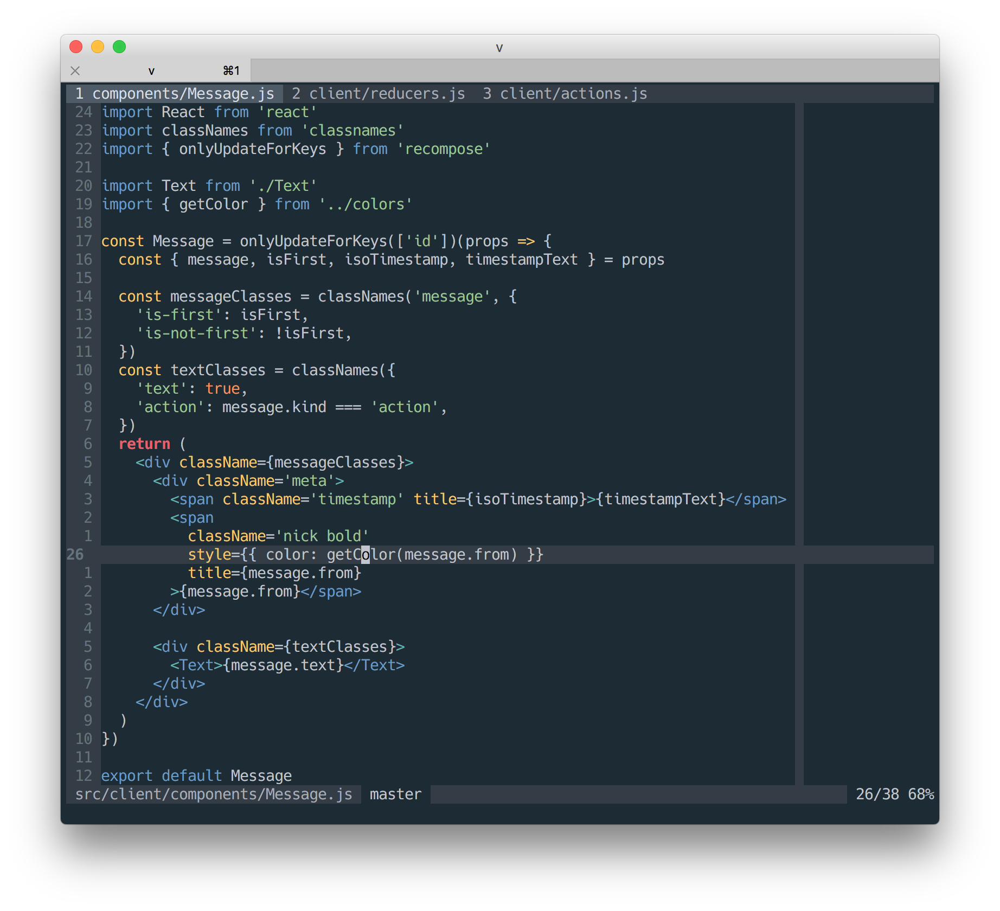

# Dotfiles for my UNIX workstation(s)

This repo uses [GNU Stow](http://brandon.invergo.net/news/2012-05-26-using-gnu-stow-to-manage-your-dotfiles.html).

To symlink Neovim dotfiles, run:

~~~
stow -t ~ -d ~/Dotfiles -v neovim
~~~

To symlink other things, change that `neovim` part to something else. Extra
setup may be required.

## Neovim

My
[`init.vim`](https://github.com/daGrevis/Dotfiles/blob/master/neovim/.config/nvim/init.vim)
(`.vimrc` replacement for [Neovim](https://neovim.io/)).

Quick install (at your own risk):

```
curl -Lo ~/.config/nvim/init.vim --create-dirs http://dagrev.is/init.vim
```

It's recommended to read `init.vim` line by line and copy paste what's relevant.
The source is heavily documented just for that reason alone.


